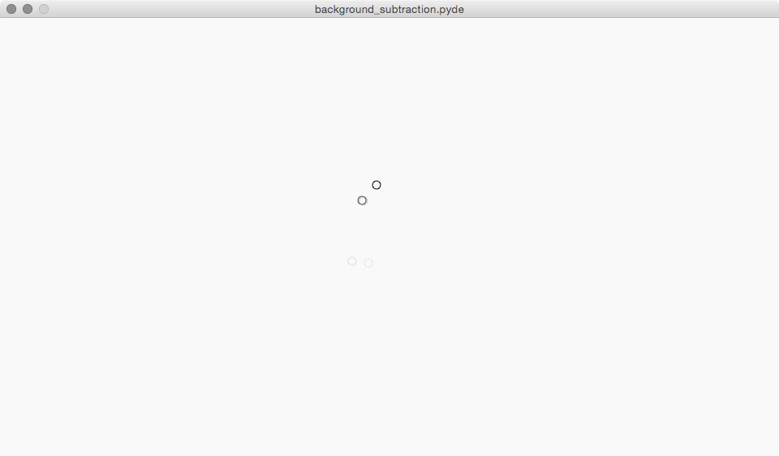
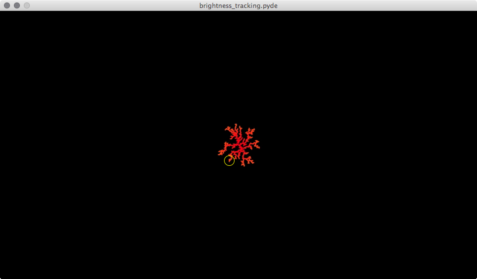
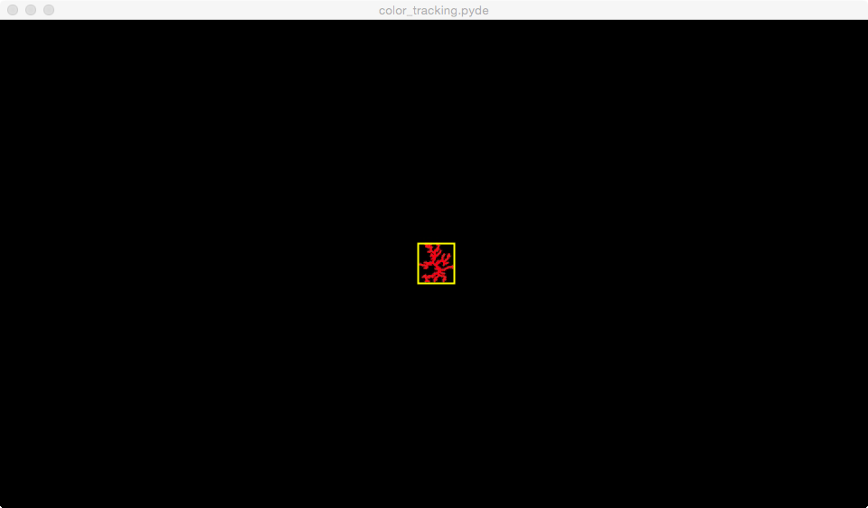
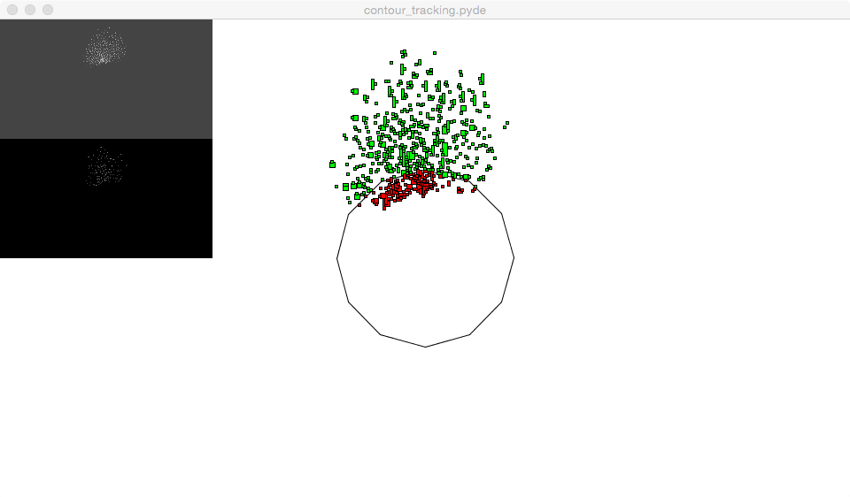
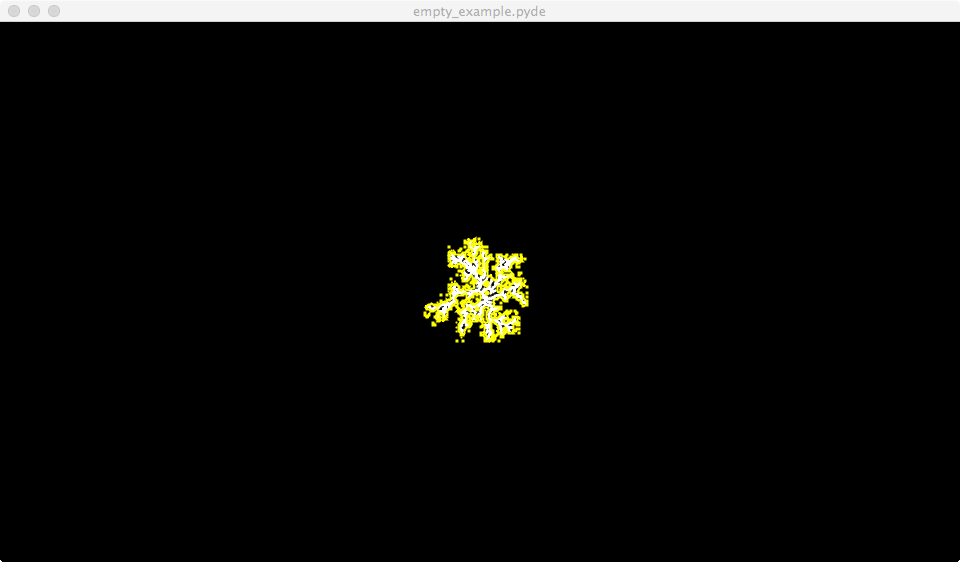
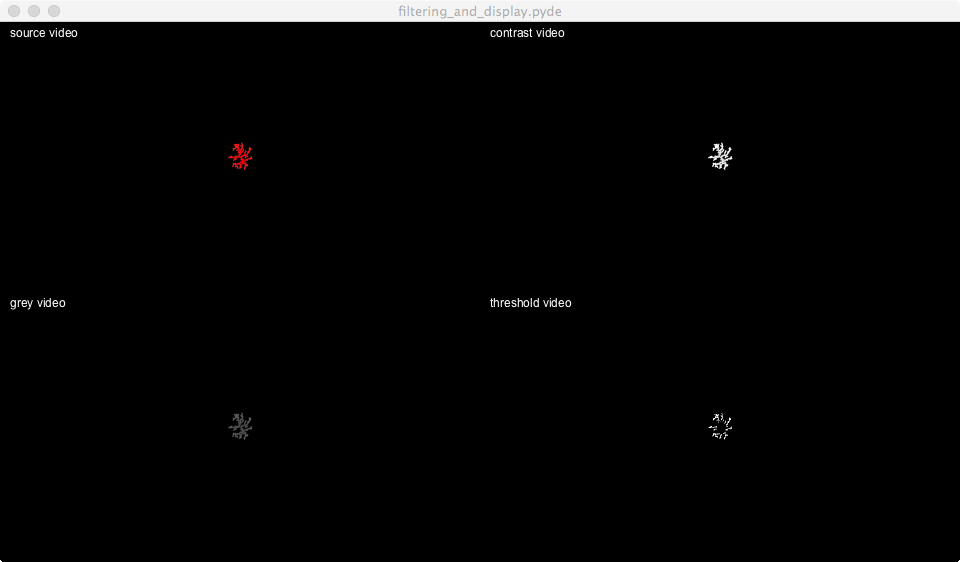
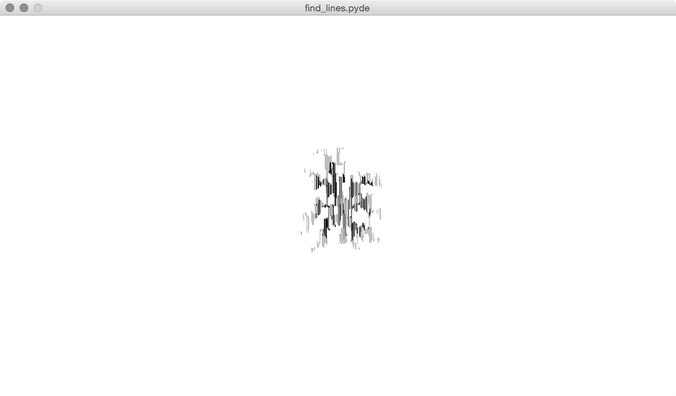
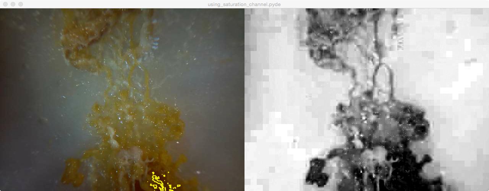

##background_subtraction
  
How to use background subtraction  

------------
##brightness_tracking
  
look for the brightest point int the video  

------------
##color_tracking
  
look for ta specific color in the video !Not working that well right now!  

------------
##contour_tracking
  
Simple sketch that tracks some spots in a video  

------------
##empty_example
  
Simple empty example  

------------
##filtering_and_display
  
Simple empty sketch  

------------
##find_lines
  
Simple sketch that looks for lines in a video  

------------
##using_saturation_channel
  
Simple sketch that uses the saturation channel  
